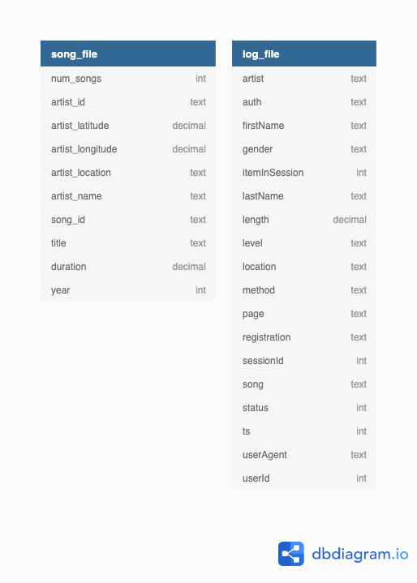
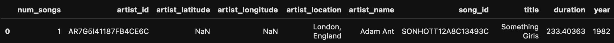
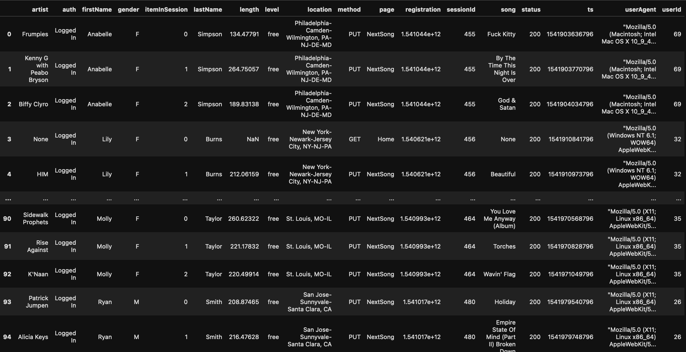
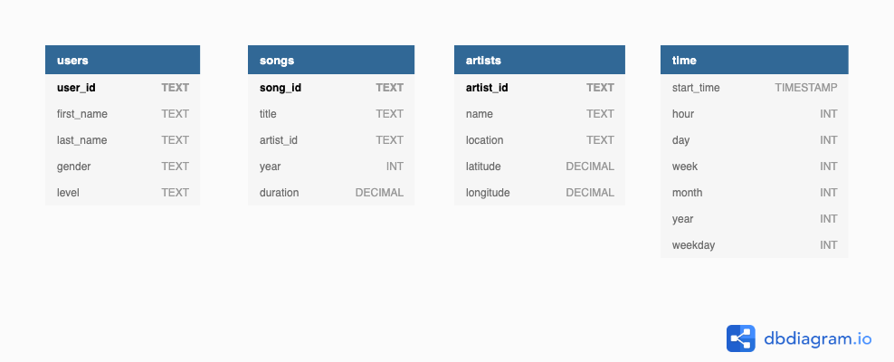
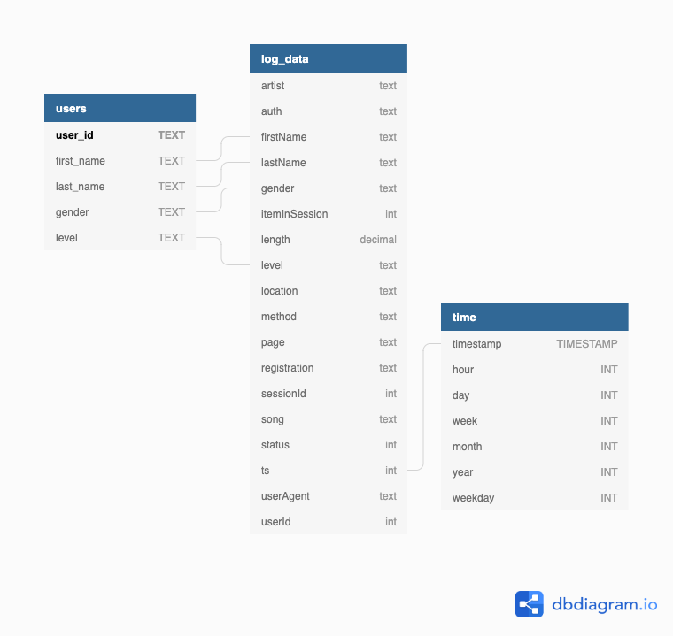
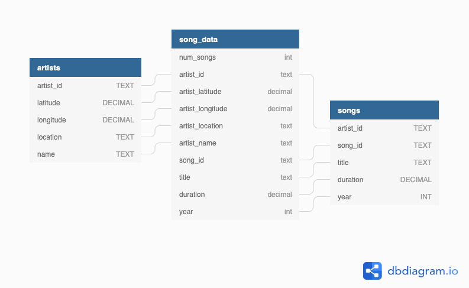
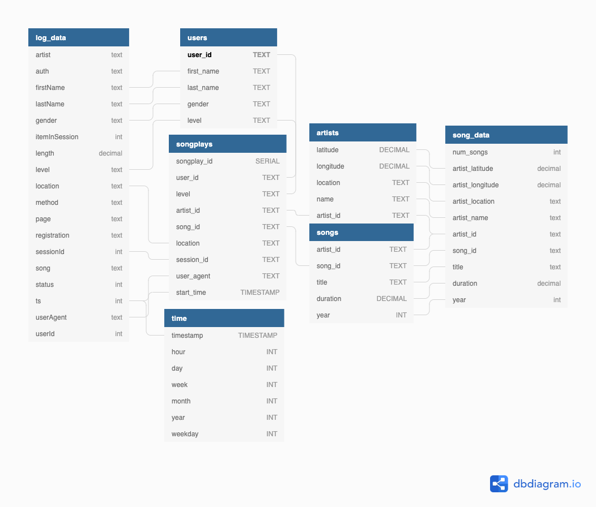
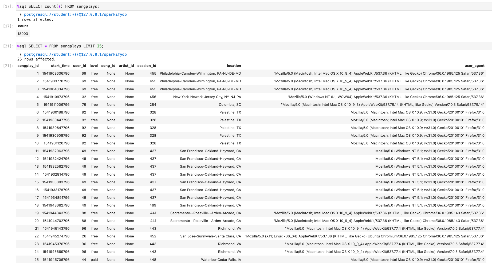

# Udacity Data Engineer Project 1

## Creating a postgres database for "Sparkify"

Sparkify is a (fictional) startup that offers music streaming services. They accumulate 
data but do not yet leverage them. My job documented in this repository is to build an
ETL pipeline. The data are stored in json files inside the folder `data/`. There
are two kinds of files, a `log_file` and a `songs_file`. 

I have built a star schema that holds four dimension-tables and one facts-table.
The database is relational; I am using PostgreSQL.

I will get the raw data out of the json files and organize them into four tables.
These four tables are going to be the dimensions tables. They will be the basis
for the facts table in the middle: The songplays table.

Here is an overview of the data and the schema:

## Original Data

### Diagram

### song_data

### log_data

## The ETL process

### Dimension Tables

Based on the two original tables I will create four dimension tables:

1. users
2. songs
3. artists
4. time

`users` and `songs` are based on `songs_data`:

`artists` and `time` are based on `log_data`:

## Star Schema

The "songplays" table is in the center of the four dimension tables. I

## The Facts Table "Songplays"

"Songplays" represents the facts table which is in the center of the star schema. It holds these columns:

- songplays_id
- user_id
- level
- artist_id
- song_id
- artist_id
- location
- session_id
- user_agent
- start_time

## Justification, benefit and analysis

With the facts table, sparkify has now many uses for business analysis. Here are some questions that can
be answered now:

- What songs are being played the most?
- What is the preferred time for songplays?
- What browser / operating system are being used?
- What is the distribution between free and paid users?

These additional information will enable sparkify to leverage data and make use of it. 
